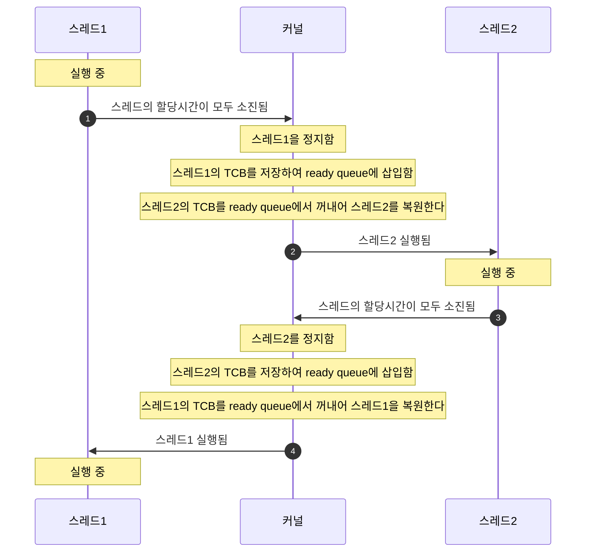

## Context Switching
Context Switching은 CPU core에서 실행중인 스레드를 정지시키고, 스레드의 현재 상태를 저장하고, 다른 스레드의 저장된 상태를 로드하는 일련의 작업을 말한다.  
현대의 컴퓨터 시스템은 멀티태스킹 시스템으로, 여러개의 프로세스가 동시에 실행되게 하기 위해 Context Switching이 항상 발생한다.  

Context Switching은 아래 경우에 발생한다:
1. 스레드가 block 될 때
2. 스케줄러가 스레드를 교체할 때
3. 인터럽트가 발생했을 때
4. 다른 우선순위가 더 높은 스레드가 ready 상태가 되었을 때

#### context switching 

## Context Switching이 성능에 부담을 주는 이유
Context Switching이 성능에 부담을 주는 이유는 다음과 같다:

#### 1. 커널 모드로의 전환
커널 모드로의 전환은 아래의 과정을 거치기 때문에 시간이 걸리는 작업이다:
1. 메모리 사용 권한을 상승시킨다.
  - 프로세스가 커널 메모리 영역을 사용할 수 있도록 메모리 사용 권한을 상승시킨다.
2. 스레드의 스택을 커널 스택으로 전환한다.
  - 모든 스레드는 자신만의 커널 스택 메모리블록을 가지고 있다. 커널 스택은 커널 영역에서 작업할 때 사용된다.
  - 커널 스택이 따로 존재하는 이유는 보안 때문이다. 유저영역 스택은 사용자가 마음대로 값을 바꿀수 있기 때문이다.
  - 커널 스택으로 전환하는 작업은 스택 포인터를 커널스택 주소로 바꾸는 것이다.
3. 스레드가 사용중인 범용 레지스터 값들을 커널스택에 백업한다.
  - 이 작업은 커널모드에서 다시 유저모드로 전환할 때 스레드를 복원하기위해 필요하다.

#### 2. Cache Miss
core에서 실행되는 스레드가 교체될 경우, 사용하던 가상메모리 테이블도 교체된다.  
그 말은 이제부터 이전 스레드에서는 사용하지 않았던 물리 메모리 영역을 사용하게 된다는 말이다.  
그렇게되면 캐시메모리에 존재하던 값들은 모두 쓸모가 없어지고 새로 가져와야 한다.  
그래서 스레드가 교체된 직후에는 cache miss가 자주 발생하고 속도가 느려진다.  

#### 3. TLB 초기화
TLB(translation look-aside buffer)는 MMU(Memory Management Unit)내부에 존재하며 L1, L2, L3 캐시와는 다른 별도의 캐시메모리이다.  
TLB에는 가상메모리주소-물리메모리주소 변환 테이블이 저장되어 있다.  
예를들면 가상메모리 주소 0xBB3E 가 물리메모리 주소 0x7F3E 에 해당한다면, 0xBB3E를 0x7F3E로 변환하는 정보를 TLB에 저장해둔다.  
그런데 context switching 때문에 스레드가 교체되면 TLB 역시 쓸모가 없어진다.  
그래서 TLB를 초기화하고 다시 작성해야 하기 때문에 속도가 느려진다.  

